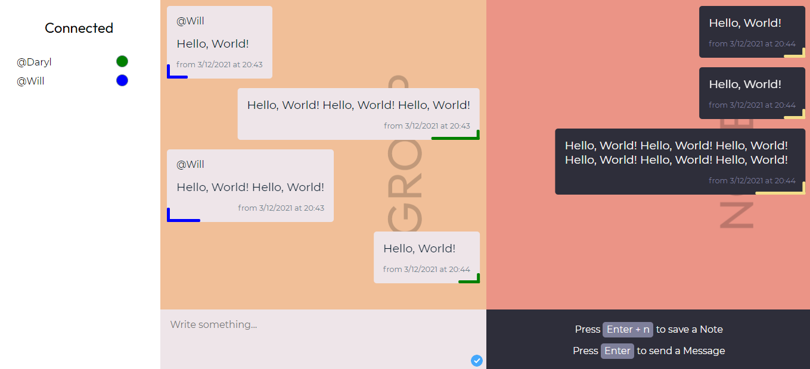

# Chatroom exercise - [Deployment][webpage]

## The Mission
Configure a node server, and make a chatroom to hang out with some friends and more!

[][webpage]

### Features

- UI that makes it easy for people to send messages in this chatroom.
- It's possible to send a message to everyone or to yourself.
- Identify who sent the message through a username.
- Make a list to show everyone who is connected to the chatroom.
    
### Future features

- Properties such as:
    - avatar
    - font-color
- Different rooms to join by code.
- Make it possible to send private messages to a person.
- Add images, emojis, videos, gifs to your messages.
- Bring back some features from MSN!
- Make a login / registration

Go check it out at https://socket.io/docs/v4 

[webpage]: https://tranquil-refuge-12512.herokuapp.com/